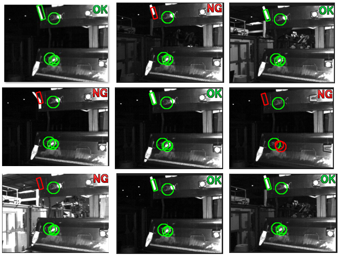
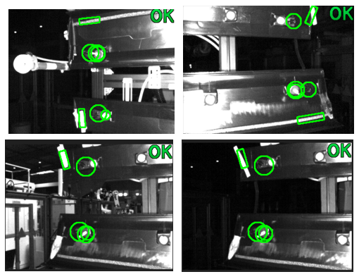
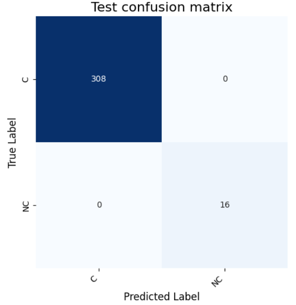
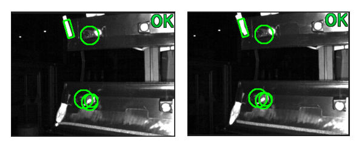

# Détection de défauts sur des images de contrôle caméra 🚀

J'ai récemment travaillé pour une entreprise industrielle qui utilise le contrôle caméra pour détecter des défauts sur leurs produits. Ce système est efficace pour détecter toutes sortes de défauts prédéfinis en utilisant une solution logicielle analytique (seuil sur le nombre de pixels blancs dans une certaine zone par exemple). 



Toutefois, Il arrive que des produits défectueux passent au travers du filtre, soit parce que le seuil, la fenêtre de détection… sont mal définis, soit parce qu'un nouveau défaut apparaît qui n'a pas été référencé avant.



Quand un défaut passe au travers, l'entreprise doit organiser des tris sur le stock interne et externe sur les périodes de production où la détection a été inefficace.

Ces tris sont coûteux en temps et en argent. 

En récupérant les images issues du contrôle caméra et en entraînant un algorithme d'IA dessus il est pourtant simple de repérer les défauts après coup et s'affranchir ainsi de tris inutiles. C'est ce que j'ai fait ici.

🏄‍♂️ **Prédire des images :**

*  Cloner ce dépôt : 
```bash
git clone git clone https://github.com/Antoine1608/Detection_defaut.git
```
*  Créer un environnement virtuel avec Python 3.10. 

* Activer votre environnement virtuel et installer les dépendances dans `requirements.txt`  

* Mettre le dossier des images à traiter dans le dossier data

* Lancer le [NOTEBOOK](app/inference-camera-control.ipynb)



👉 **Entraîner un modèle :**

L'IA va s'entraîner sur des photos de pièces défectueuses et de bonnes pièces – pas besoin de définir un seuil ou une zone – il est recommandé mais pas nécessaire de limiter le bruit (différents arrière-plans...) pour que l'algorithme apprenne plus vite et avec moins d'images. 

Exemple : double adhésifs - Le contrôle caméra ne peut pas faire la différence entre les bonnes et les mauvaises pièces



Le notebook d'entraînement se trouve [ICI](src/train-camera-control.ipynb)


